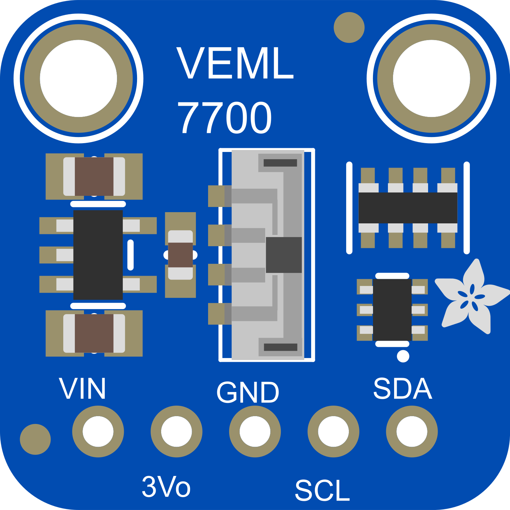

# mkigor_veml

@brief		Arduino Library for sensor light VEML7700. 
@author		Igor Mkprog, mkprogigor@gmail.com 
@version	V1.0	@date	16.10.2025 

@example	of use https://github.com/mkprogigor/mkigor_esp32c3_ws 

@datails	of using. 1st - wake up sendor from shut down, metod cl_VEML7700.wakeUp(), wait for > 800 ms and receive light ALS and WHITE by metod readAW(). Method do not has fix time executing, because it find and select proper coefficient for gain & time counting. It can takes time form 500 to 3000ms. 
I correct a little bit std algoritm from datasheet of Vishay company. From my expirience, should take one or couple times more measuremant. Results will be more stable. 

 